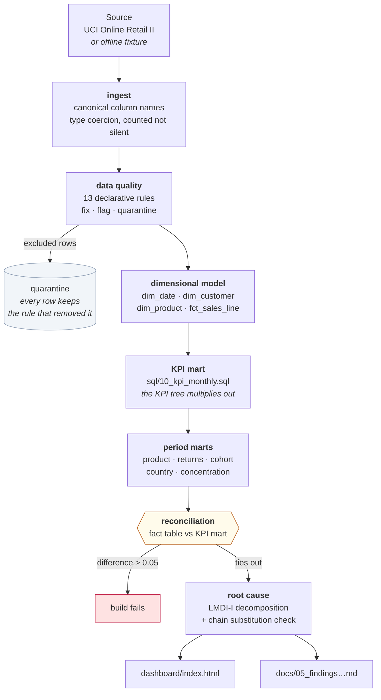

# Operational Analytics & KPI Steering

**A reproducible pipeline that answers one management question end to end: net revenue is down — why, how much of it is fixable, and who should do what by when.**

Raw transactions → governed data quality layer → dimensional model → KPI mart → driver decomposition → an interactive dashboard and a written decision memo. One command, no manual steps, and every published figure reconciles back to the fact table or the build fails.

[](https://www.python.org/)
[](https://duckdb.org/)
[](LICENSE)
[](https://github.com/DataVantage/operational-analytics-kpi-steering/actions/workflows/ci.yml)

---

## The question

> *"Net revenue in the last complete month is behind the same month last year. Where did it go, how much of the gap can we actually get back, and what do we do on Monday?"*

That is the question a Head of Operations or a Commercial Director actually asks. It is not "build me a dashboard". Answering it properly needs five things in order, and this repository does all five:

| # | Step | Where it lives |
|---|---|---|
| 1 | Decide which numbers count, and define them so they can't be argued with | [`docs/02_kpi_definitions.md`](docs/02_kpi_definitions.md) |
| 2 | Make the data trustworthy — and be explicit about what was excluded and why | [`config/dq_rules.yml`](config/dq_rules.yml), [`docs/03_data_quality_framework.md`](docs/03_data_quality_framework.md) |
| 3 | Model it so any slice reconciles to the headline | [`sql/`](sql/), [`docs/04_data_model.md`](docs/04_data_model.md) |
| 4 | Split the change into drivers that add up exactly | [`src/oakpi/analysis.py`](src/oakpi/analysis.py) |
| 5 | Turn it into owned actions with a number attached | [`docs/05_findings_and_recommendations.md`](docs/05_findings_and_recommendations.md) |

**The dashboard is step 5 of 5, not step 1 of 1.** That ordering is the whole point of the project.

---

## What it produces

**[→ Open the live dashboard](https://datavantage.github.io/operational-analytics-kpi-steering/dashboard/)** · **[→ Read the generated decision memo](docs/05_findings_and_recommendations.md)**

The dashboard is a single self-contained HTML file. No server, no build step, no login — open it from disk or publish the folder with GitHub Pages.

<!-- Replace with a real screenshot once you have published the page:
      -->

It contains, in the order a decision-maker reads:

1. **Six KPI cards** — net revenue, return rate, active customers, orders, AOV, and the data quality score sitting on the same row as the business numbers, deliberately.
2. **Revenue trend**, with incomplete months drawn faded so nobody compares a part-month to a full one.
3. **A driver waterfall** — the change split into five factors that sum to it exactly.
4. **Return rate by product family over time**, plus the value at stake.
5. **Market contribution** and **article-level Pareto**.
6. **A cohort retention grid** — the difference between "a weak month" and "a shrinking base".
7. **The data quality scorecard and a reconciliation table**, published rather than buried.

---

## The findings

> ⚠️ **The committed build runs on a synthetic fixture, not the real dataset.** The repository ships a seeded, schema-identical sample so that `make demo` works offline and in CI. Every artefact built from it carries a `SYNTHETIC DEMO SAMPLE` banner. To publish real figures, run `make data && make run` — the fetch, the analysis and the written memo all regenerate from the real UCI source, and the banner disappears on its own.

From the demo build, the pipeline finds and quantifies three things that a single revenue chart would have shown as one undifferentiated drop:

| What it found | The number | Why it matters |
|---|---|---|
| Returns broke on one product family | Return rate 1.7% → 18.2%; **GBP 6,846** would have been retained at last year's rate | A margin problem wearing a demand problem's clothes |
| The active customer base shrank, and it was acquisition-led | −11.9% active customers = **56%** of the total change; new customers −35% vs returning −7% | Sends the budget to top-of-funnel, not to win-back |
| One market fell far faster than the group | Germany −66% against a group −25%, a 41 pp gap | A local cause hiding inside a group-level number |

Each of these is produced by a **stated trigger rule with a stated threshold** (see `INSIGHT_RULES` in [`src/oakpi/report.py`](src/oakpi/report.py)), not by narrative written after the fact. An analyst who disagrees with a threshold can see exactly which one produced the sentence and change it.

---

## Run it yourself

```bash
git clone https://github.com/DataVantage/operational-analytics-kpi-steering.git
cd operational-analytics-kpi-steering
pip install -r requirements.txt

make demo     # runs on the committed offline fixture — ~30 seconds, no download
make data     # fetch the real UCI Online Retail II dataset (~45 MB)
make run      # rebuild the warehouse, dashboard and memo from the real data
make test     # 47 tests
```

**No dependencies you don't already have.** DuckDB is the default warehouse engine, but if it isn't installed the pipeline falls back to SQLite from the standard library and runs the *same SQL* — see [Design decisions](#design-decisions) below. The only hard requirements are pandas, numpy and PyYAML.

---

## How it works



### The KPI tree

Everything hangs off one identity, and it holds to the cent:

```
net revenue = active customers
              × orders per customer
              × units per order
              × average unit price
              × (1 − return rate)
```

Each factor is a column in `kpi_monthly`, the product is asserted against reported revenue in the test suite, and the decomposition below operates on exactly these five terms. Nothing is estimated into existence.

### Splitting the change: LMDI-I

Contributions are computed with an **additive logarithmic mean Divisia index**. Two properties make it the right choice for a management report:

- **It is exact.** The five contributions sum to the observed change with no residual, so there is no "other" bar to hide behind.
- **It is order independent.** No factor gets credit simply for being decomposed first.

For comparison the same change is also decomposed by **chain substitution** (*Kettensubstitutionsverfahren*) and printed in the memo's appendix — the method most controlling departments recognise on sight, shown as a cross-check precisely because it *is* order dependent. Both are asserted against the observed delta in [`tests/test_analysis.py`](tests/test_analysis.py).

### Data quality as a governed layer, not a cleanup script

The 13 rules live in [`config/dq_rules.yml`](config/dq_rules.yml) — reviewable by an analyst who does not read Python. Each declares a dimension, a severity, an action and a **written rationale that is published in the report**.

| Action | Meaning | Example |
|---|---|---|
| `fix` | Repaired by a documented, deterministic transformation | Missing description filled from the modal description for that stock code |
| `flag` | Row stays and keeps its revenue; a boolean column marks it | ~21% of lines have no customer id — real revenue, unusable for retention |
| `quarantine` | Row is removed from KPIs and moved to a table that names the rule | Negative unit prices: adjustment postings, not sales |

Three principles are enforced in code:

1. **Nothing disappears silently.** `rows_in == rows_clean + rows_quarantined` is a test.
2. **Removing rows is the last resort**, because removing rows changes the revenue total.
3. **Quality is scored, not described.** One severity-weighted number, `--min-dq-score` fails the build below a floor.

---

## Design decisions

Things I chose on purpose, and the reasoning — this section is the part I would actually want to talk through in an interview.

**Analytics in SQL, orchestration in Python.**
The KPI logic lives in `sql/` as plain statements a BI developer can read, review and lift into dbt or a Power BI dataflow. Python decides *which* script runs with *which* parameters. Mixing the two makes analytical logic invisible to everyone who isn't a Python developer.

**Two warehouse engines, one dialect.**
DuckDB is the default. SQLite is a zero-install fallback so the repository runs anywhere, including a bare CI runner. Portability is bought deliberately rather than accidentally: the SQL is held to the common subset of both, and the one thing that genuinely differs — date arithmetic — is pre-computed into `dim_date` as `prior_year_month_key` and `prior_month_key`. Year-over-year comparison becomes an equi-join. It is portable, auditable in one place, and faster.

**The reporting month is chosen, not assumed.**
`analysis.current_period: auto` selects the most recent month that is *complete in the source*. Comparing a part-month to a full one is the most common way a monthly report announces a collapse that is really a calendar artefact.

**Customer KPIs are computed on the population that has customers.**
About a fifth of revenue arrives with no customer id. Including it in revenue-per-customer would inflate the numerator without the denominator. It is routed to a guest segment, kept in revenue, excluded from customer metrics, and the split is reconciled in the report so the two halves visibly add to the headline.

**The report is generated, not written.**
Every figure in `docs/05_findings_and_recommendations.md` is read from the marts at build time. The document cannot drift from the pipeline, and re-running against a different period produces a correspondingly different document rather than a stale one with new dates.

**Reconciliation is a gate, not a section.**
If the fact table and the KPI mart disagree by more than 0.05, the pipeline raises rather than publishing. A dashboard people keep a private spreadsheet next to is worse than no dashboard.

### What I would do differently at production scale

- Replace the bespoke rule engine with **Great Expectations** or **dbt tests** — the concepts map one-to-one; the bespoke version exists here to show the reasoning rather than to hide it behind a framework.
- Move the SQL into **dbt** for lineage, incremental models and documentation, and schedule it with **Airflow** or **Dagster**.
- The product family is derived from a keyword in the description because the source has no category column. In production this belongs in a governed product master, not in a heuristic — it is documented as an approximation rather than presented as truth.
- Add **statistical significance testing** on the period comparison. At the current volumes the movements are far outside noise, but a −2% month deserves a confidence interval before it becomes an action.

---

## Repository layout

```
├── config/
│   ├── config.yml              every tunable value, no magic numbers in code
│   └── dq_rules.yml            13 data quality rules with written rationales
├── sql/                        the analytical layer — portable, commented SQL
│   ├── 00_indexes.sql
│   ├── 10_kpi_monthly.sql      the KPI mart the whole project reads
│   ├── 11_product_performance.sql
│   ├── 12_returns_by_family.sql
│   ├── 13_cohort_retention.sql
│   ├── 14_country_performance.sql
│   ├── 15_customer_concentration.sql
│   └── 16_reconciliation.sql   the check that makes the rest believable
├── src/oakpi/
│   ├── cli.py                  one command runs the whole pipeline
│   ├── config.py               configuration access
│   ├── engine.py               DuckDB/SQLite adapter + SQL statement scanner
│   ├── ingest.py               acquisition and staging
│   ├── dq.py                   the rule engine
│   ├── model.py                star schema construction
│   ├── kpi.py                  SQL orchestration + the reconciliation gate
│   ├── analysis.py             period selection, LMDI, chain substitution
│   ├── dashboard.py            self-contained HTML generation
│   ├── report.py               generated findings + trigger rules
│   └── synth.py                the offline fixture generator
├── tests/                      47 tests, stdlib unittest, no pytest required
├── docs/                       business question, KPI definitions, DQ, model, findings
├── dashboard/index.html        generated — the deliverable
└── data/sample/                the committed offline fixture (1.4 MB, gzipped)
```

---

## Skills this demonstrates

| Area | Where to look |
|---|---|
| SQL — CTEs, window functions, Pareto, cohort logic, dialect portability | [`sql/`](sql/) |
| Dimensional modelling — Kimball star, conformed dimensions, surrogate keys, grain | [`src/oakpi/model.py`](src/oakpi/model.py), [`docs/04_data_model.md`](docs/04_data_model.md) |
| KPI design and governance — definitions, a tree that multiplies out, reconciliation | [`docs/02_kpi_definitions.md`](docs/02_kpi_definitions.md), [`sql/10_kpi_monthly.sql`](sql/10_kpi_monthly.sql) |
| Data quality — declarative rules, severity weighting, quarantine, scoring | [`config/dq_rules.yml`](config/dq_rules.yml), [`src/oakpi/dq.py`](src/oakpi/dq.py) |
| Root cause analysis — LMDI-I, chain substitution, cohort and Pareto diagnostics | [`src/oakpi/analysis.py`](src/oakpi/analysis.py) |
| Python engineering — CLI, config-driven design, logging, 47 tests, CI | [`src/oakpi/`](src/oakpi/), [`tests/`](tests/) |
| Business communication — decision memo, owned actions, quantified value | [`docs/05_findings_and_recommendations.md`](docs/05_findings_and_recommendations.md) |
| Visualisation — self-contained interactive dashboard, no infrastructure | [`src/oakpi/dashboard.py`](src/oakpi/dashboard.py) |

---
**Companion project:** [customer-service-case-management](https://github.com/DataVantage/customer-service-case-management)
answers the same kind of question from the requirements-engineering side —
as-is/to-be process, user stories and a traceability matrix that fails the
build on a broken link, on a real help-desk event log.

## Source data

**Online Retail II**, Chen, D. (2019), UCI Machine Learning Repository. <https://doi.org/10.24432/C5CG6D>
Transactions from a UK-based online giftware retailer, 01/12/2009 – 09/12/2011, ~1,067,371 rows. Licensed CC BY 4.0.

The workbook is not committed; `make data` fetches it. `data/sample/` holds the seeded synthetic fixture used for the offline demo and for CI.

## Licence

MIT — see [LICENSE](LICENSE).

---

*Built by **Serkan Akdemir** — Operational Analytics & Digital Process Analyst. Data, processes, systems and people, connected until something measurably improves.*
