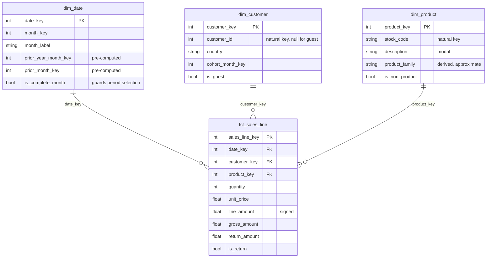

# 4. The data model

A Kimball-style star: three conformed dimensions and one transaction-grain fact.
Built in [`src/oakpi/model.py`](../src/oakpi/model.py), queried by everything in
[`sql/`](../sql/).



---

## Grain

**One row per invoice line.** This is the lowest grain the source offers, and
therefore the only grain from which every downstream KPI can be re-derived. It
is also the grain at which returns can be matched to articles — aggregate to
invoice level and the product-family return analysis becomes impossible.

Everything else in the project is an aggregate of this table. Nothing is
computed and then stored as a competing "truth".

---

## The design decision worth defending

`dim_date` carries **`prior_year_month_key`** and **`prior_month_key`** as
columns.

Without them, a year-over-year comparison looks like this — and looks different
on every engine:

```sql
-- DuckDB
WHERE date_trunc('month', d) = date_trunc('month', current_date - INTERVAL 1 YEAR)
-- SQLite
WHERE strftime('%Y-%m', d) = strftime('%Y-%m', date('now', '-1 year'))
-- SQL Server
WHERE DATEFROMPARTS(...) = DATEADD(year, -1, ...)
```

With them, it is an equi-join on an integer.

Three things follow:

1. **The SQL is portable.** The same statements run unchanged on DuckDB and
   SQLite, which is what lets this repository run on a bare CI machine and on a
   laptop with a proper warehouse installed.
2. **The comparison logic lives in one auditable place.** If the business decides
   that "prior year" means the same *trading* period rather than the same
   calendar month, that is one column definition, not a search through every
   query.
3. **It is faster.** An integer equality is index-friendly; a function applied to
   a column is not.

This is the standard Kimball argument for putting calendar intelligence in the
date dimension rather than in the queries, and it is worth stating explicitly
because it is the thing an interviewer is most likely to probe.

---

## Dimensions

### `dim_date`

One row per calendar day between the first and last transaction. Carries year,
quarter, month, month label, weekday, ISO week, and the two prior-period keys.

**`is_complete_month`** deserves a mention. It compares the days actually
observed in the source for that month against the calendar month, and is `false`
when the source starts mid-month or ends mid-month. Period selection refuses to
choose an incomplete month, so the report cannot compare nine days of December
against a full December and announce a collapse.

### `dim_customer`

One row per identified customer, plus **one deliberate row for guests**
(`customer_key = -1`).

The guest row is not a hack. It is a *type 0 unknown member*, the standard
Kimball handling for a fact that has no dimensional context. The alternative —
a nullable foreign key — breaks inner joins, silently drops a fifth of revenue
from every dimensional query, and produces a country slice that does not add up
to the headline. With an explicit member, the guest revenue appears as
`Unidentified` in the market table, is obviously not a country, and the slice
reconciles.

`country` is the customer's **modal** country, not the country on each
transaction, so a customer does not move between markets mid-analysis.
`cohort_month_key` is the month of their first order.

### `dim_product`

One row per stock code. `description` is the modal description for that code —
the source contains multiple spellings, and picking the most frequent is a
documented, deterministic choice.

`is_non_product` marks postage, manual adjustments, bank charges and similar.
These are excluded from product-level analysis but **kept in net revenue**,
because they hit the P&L. Dropping them would make the product tables tidier and
the revenue total wrong.

`product_family` is derived from the first material or motif keyword in the
description. This is an **approximation and is labelled as one**: the source has
no category column, and inventing one by hand for 4,000 stock codes would be a
worse kind of fiction. In production this belongs in a governed product master.

---

## Fact

### `fct_sales_line`

Additive measures only, which is what makes any slice reconcile to any other:

| Measure | Definition | Why it exists |
|---|---|---|
| `line_amount` | `quantity × unit_price`, **signed** | A plain `SUM` over any slice yields net revenue with no `CASE` anywhere downstream |
| `gross_amount` | `line_amount` where not a return, else 0 | Sales before returns, still additive |
| `return_amount` | `−line_amount` where a return, else 0 | Returns as a positive number, still additive |
| `units_sold` / `units_returned` | The same split on quantity | Basket-size analysis |

`gross_amount − return_amount = line_amount` holds row by row, and is asserted in
the test suite. Every one of these is additive across every dimension — no
ratios, no percentages, no semi-additive traps stored in the fact table. Ratios
are computed in the KPI layer, where their denominators are explicit.

The row also carries the data quality flags (`is_guest_customer`,
`is_zero_price`, `is_quantity_outlier`, …) so that a sensitivity check —
"what does this look like without the flagged rows?" — is a `WHERE` clause
rather than a re-run.

---

## Marts

| Table | Grain | Answers |
|---|---|---|
| `kpi_monthly` | month | the headline and the five tree factors |
| `mart_product_period` | product | which articles moved, with a Pareto share |
| `mart_returns_family` | product family | where returns broke, and the value at stake |
| `mart_returns_monthly` | month × family | since when |
| `mart_cohort_retention` | cohort × offset | is the base holding |
| `mart_country_period` | country | which markets moved |
| `mart_customer_concentration` | customer | how much rests on how few |
| `mart_reconciliation` | check | does any of this tie out |

`mart_reconciliation` is the one that makes the other seven believable. It
compares the fact table against the published KPI mart on rows, gross revenue,
returns, net revenue, orders, and the identified/guest split. If any difference
exceeds 0.05, the pipeline raises instead of writing a dashboard.

---

## Indexes

Created after the load rather than before, because building an index once over a
finished table costs less than maintaining it through a bulk insert. They cover
the fact table's month and dimension keys — the only access patterns the marts
actually use. See [`sql/00_indexes.sql`](../sql/00_indexes.sql).
